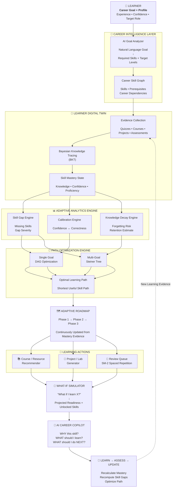

# 🧭 SkillPilot AI — Your Career Intelligence Navigator

> **You choose the destination. SkillPilot navigates the optimal path.**

SkillPilot AI is a full-stack, AI-driven learning platform that treats career growth as a continuously adaptive system — not a static list of courses. It builds a live "digital twin" of what you actually know (via Bayesian Knowledge Tracing), finds the shortest path across one or more career goals (via Steiner-tree graph optimization), catches false confidence before it costs you time (via calibration analysis), and predicts when you'll forget what you learned (via spaced repetition) — all explained by an AI copilot that knows your exact skill state.

`FastAPI` · `React 18 + Vite` · `Bayesian Knowledge Tracing` · `Groq LLM` · `NetworkX` · `SQLite`

---

## Table of Contents

- [Why SkillPilot is different](#why-skillpilot-is-different)
- [Features](#features)
- [Tech Stack](#tech-stack)
- [Architecture](#architecture)
- [Project Structure](#project-structure)
- [Prerequisites](#prerequisites)
- [Setup & Run](#setup--run)
- [Environment Variables](#environment-variables)
- [API Endpoints](#api-endpoints)
- [Pages & Features](#pages--features)
- [Career Goals Supported](#career-goals-supported)
- [Offline Mode](#offline-mode)
- [Export PDF Report](#export-pdf-report)
- [Roadmap / Known Limitations](#roadmap--known-limitations)

---

## Why SkillPilot is different

Most learning recommenders answer one question: *"what course should I take next?"* SkillPilot answers five:

| Question | Traditional recommender | SkillPilot AI |
|---|---|---|
| What do you actually know? | Self-reported checkbox | Bayesian posterior from quiz evidence |
| What's the fastest path to *your* goal(s)? | Fixed course sequence | Steiner-tree shared spine across multiple goals |
| Are you confidently wrong? | Not tracked | Confidence-vs-correctness calibration (Dunning-Kruger flag) |
| Will you forget this? | Not tracked | SM-2 spaced-repetition decay model |
| What should happen if I do X? | No preview | Instant what-if readiness projection |

That's the pitch in one line: **it doesn't just recommend — it measures, doubts, predicts, and explains.**

---

## Features

| Feature | Description |
|---|---|
| **Learner Digital Twin** | A living skill profile — mastery is updated by quizzes, not just course completions |
| **Adaptive Roadmap** | Prerequisite DAG with locked/unlocked phases; AI re-routes the path on poor quiz scores |
| **Bayesian Knowledge Tracing (BKT)** | Quiz results update mastery using Bayes' rule — the same model family used by Khan Academy / ALEKS |
| **Confidence Calibration** | Detects Dunning-Kruger patterns (high confidence + wrong answers) |
| **Spaced Repetition (SM-2)** | Anki-style review queue — predicts memory decay and schedules revision |
| **What-If Simulator** | Instantly recalculates roadmap impact of completing any skill |
| **AI Learning Copilot** | Context-aware chat — knows your skill gaps, locked phases, and decay status |
| **Multi-Goal Roadmap** | Steiner-tree algorithm finds the shared spine for two career goals at once |
| **PDF Export** | One-click full progress report saved to your local Downloads folder |
| **Offline Mode** | Works without the backend — full local fallback via `localStorage` |

---

## Tech Stack

### Backend

| Layer | Technology |
|---|---|
| API | FastAPI + Uvicorn |
| ML Engine | NumPy, Pandas, scikit-learn, NetworkX |
| LLM | Groq API (`llama3-8b-8192`), free tier, with rule-based fallback |
| Database | SQLite (plain `sqlite3`, no ORM) |
| Auth | SHA-256 password hashing, Bearer token |

### Frontend

| Layer | Technology |
|---|---|
| Framework | React 18 + Vite |
| Styling | Tailwind CSS (dark theme, glassmorphism) |
| Routing | React Router v7 |
| Charts | Recharts (radar, bar, sparkline) |
| HTTP | Axios |
| PDF | jsPDF + jspdf-autotable |
| Icons | Lucide React |

---

```
## 🏗️ System Architecture

The platform models each learner as a dynamic **Digital Twin** and continuously optimizes their learning path using skill dependencies, mastery evidence, confidence calibration, knowledge decay, and career objectives.



**Goal → Skill Graph → Learner Modeling → Gap Analysis → Path Optimization → Adaptive Roadmap → Learning → Assessment → Recalculation**


Groq LLM sits alongside `goal_analyzer.py` and the AI Copilot endpoint; both fall back to deterministic rule-based logic if `GROQ_API_KEY` isn't set, so the app never breaks mid-demo for lack of a key.

---

## Project Structure

```
hcl-project/
├── backend/
│   ├── api.py                        ← FastAPI REST API (main entry point)
│   ├── app.py                        ← Streamlit UI (alternative frontend)
│   └── personalized-learning/
│       ├── .env                      ← GROQ_API_KEY goes here
│       ├── requirements.txt
│       ├── data/
│       │   ├── skills.csv            ← 57 skills across 10 categories
│       │   ├── roles.csv             ← 8 career roles with required skill levels
│       │   ├── courses.csv           ← 25 courses mapped to skills
│       │   ├── prerequisites.csv     ← Prerequisite DAG edges
│       │   └── quiz_bank.json        ← Quiz questions for 5 skills
│       ├── engine/
│       │   ├── goal_analyzer.py      ← Free-text → learner profile (LLM + rule-based)
│       │   ├── graph.py              ← Prerequisite DAG, topo order, multi-goal merge
│       │   ├── skill_gap.py          ← Gap computation + readiness score
│       │   ├── recommender.py        ← Hybrid TF-IDF + gap course ranking
│       │   ├── adaptive.py           ← Bayesian Knowledge Tracing (BKT)
│       │   ├── calibration.py        ← Confidence calibration, Dunning-Kruger detection
│       │   ├── whatif.py             ← What-if readiness simulator
│       │   └── spaced_repetition.py  ← SM-2 spaced repetition scheduler
│       └── database/
│           ├── db.py                 ← SQLite persistence layer
│           └── learning.db           ← Auto-created on first run
└── frontend/
    ├── src/
    │   ├── pages/
    │   │   ├── CommandCenter.jsx     ← Home dashboard + goal navigator
    │   │   ├── MyTwin.jsx            ← Skill radar + mastery evidence
    │   │   ├── SkillMap.jsx          ← Interactive knowledge graph
    │   │   ├── Roadmap.jsx           ← Phase roadmap with locked/unlocked
    │   │   ├── NextAction.jsx        ← AI-selected next intervention
    │   │   ├── Assessments.jsx       ← BKT quiz with calibration
    │   │   ├── Adaptations.jsx       ← AI path change history
    │   │   ├── WhatIf.jsx            ← What-if simulator
    │   │   ├── ProjectLab.jsx        ← Skill-targeted projects
    │   │   ├── AICopilot.jsx         ← Context-aware chat
    │   │   ├── Settings.jsx          ← Profile + PDF export
    │   │   └── LandingPage.jsx       ← Login / Register
    │   ├── store/
    │   │   └── LearnerContext.jsx    ← Global state + API calls + offline fallback
    │   ├── components/
    │   │   ├── Sidebar.jsx
    │   │   ├── TopBar.jsx
    │   │   └── SkillBar.jsx
    │   └── utils/
    │       └── exportPDF.js          ← PDF report generator
    └── package.json
```

---

## Prerequisites

- **Python 3.10+**
- **Node.js 18+**
- A **Groq API key** — free, no credit card, at [console.groq.com](https://console.groq.com). Optional: the app falls back to rule-based logic without it.

---

## Setup & Run

### 1. Backend (FastAPI)

```cmd
cd hcl-project\backend\personalized-learning

:: Activate the virtual environment
hcl\Scripts\activate

:: Install dependencies
pip install -r requirements.txt

:: Add your Groq API key to .env
:: GROQ_API_KEY=gsk_xxxxxxxxxxxxxxxxxxxxxxxx

:: Start the API server
cd ..
uvicorn api:app --reload --port 8000
```

macOS/Linux equivalent:

```bash
cd hcl-project/backend/personalized-learning
source hcl/bin/activate
pip install -r requirements.txt
cd ..
uvicorn api:app --reload --port 8000
```

- API: `http://localhost:8000`
- Interactive docs: `http://localhost:8000/docs`

### 2. Frontend (React + Vite)

Open a **new terminal**:

```bash
cd hcl-project/frontend
npm install      # first time only
npm run dev
```

Open `http://localhost:3000`.

> The frontend works even if the backend isn't running — it automatically falls back to local mode using `localStorage`.

### 3. Streamlit UI (optional)

The original Streamlit interface is still available as a lightweight alternative:

```bash
cd hcl-project/backend/personalized-learning
source hcl/bin/activate      # Windows: hcl\Scripts\activate
streamlit run ../app.py
```

Opens at `http://localhost:8501`.

---

## Environment Variables

Create or edit `backend/personalized-learning/.env`:

```env
GROQ_API_KEY=gsk_xxxxxxxxxxxxxxxxxxxxxxxx
```

| Variable | Required | Description |
|---|---|---|
| `GROQ_API_KEY` | Optional | Enables LLM-powered goal analysis and the AI Copilot. Falls back to rule-based logic if unset. |

---

## API Endpoints

| Method | Endpoint | Description |
|---|---|---|
| `POST` | `/api/register` | Create account, seed skill profile |
| `POST` | `/api/login` | Authenticate, return learner state |
| `GET` | `/api/me` | Get current learner state (requires token) |
| `GET` | `/api/goals` | List all available career goals |
| `GET` | `/api/quiz?skill=X` | Get quiz questions for a skill |
| `GET` | `/api/quiz/skills` | List all skills with quiz questions |
| `POST` | `/api/analyze-goal` | Reanalyze goal text, update profile |
| `GET` | `/api/roadmap` | Get topological learning order |
| `GET` | `/api/recommendations` | Get ranked course recommendations |
| `POST` | `/api/quiz/submit` | Submit quiz → BKT update + adaptation |
| `POST` | `/api/whatif` | Simulate readiness gain for skills |
| `GET` | `/api/review-queue` | SM-2 spaced repetition queue |
| `POST` | `/api/chat` | Context-aware AI copilot message |
| `POST` | `/api/projects/complete` | Mark a project as done |
| `GET` | `/api/projects/completed` | List completed project IDs |

---

## Pages & Features

| Page | Route | What it does |
|---|---|---|
| Command Center | `/` | Greeting + goal navigator, dashboard overview |
| My Twin | `/twin` | Skill radar, mastery evidence, false-mastery alerts, decay |
| Skill Map | `/skillmap` | Interactive knowledge graph — click any node for details |
| Learning Path | `/roadmap` | Phase roadmap with locked/unlocked milestones |
| Next Action | `/next-action` | AI-selected best intervention with reasoning |
| Assessments | `/assess` | BKT quiz — updates mastery + fires path adaptations |
| Adaptations | `/adaptations` | Before/after view of every AI path change |
| What-If | `/whatif` | Simulate readiness change from completing any skill |
| Project Lab | `/projects` | Gap-targeted projects, mark as complete |
| AI Copilot | `/copilot` | Context-aware chat (Groq LLM or rule-based fallback) |
| Settings | `/settings` | Update profile, export PDF report |

---

## Career Goals Supported

| Goal | Key Skills |
|---|---|
| AI Engineer | Python, ML, Deep Learning, PyTorch, LLM, RAG, MLOps |
| Data Scientist | Python, Pandas, Statistics, SQL, Data Visualization |
| Full Stack Developer | React, Node.js, JavaScript, REST APIs, Databases |
| Cybersecurity Specialist | Network Security, Ethical Hacking, Penetration Testing |
| Cloud DevOps Engineer | Docker, Kubernetes, AWS, Terraform, CI/CD |
| UI/UX Designer | Figma, User Research, Wireframing, Design Systems |
| Product Manager | Product Management, Agile/Scrum, Business Strategy |
| Blockchain Engineer | Solidity, Smart Contracts, Web3, Cryptography |

---

## Offline Mode

If the FastAPI backend isn't running, the frontend automatically switches to **local mode**:

- Register/login stored in `localStorage`
- BKT mastery updates computed in the browser
- What-if simulation runs locally
- AI Copilot uses a rule-based fallback
- All state persists across page refreshes via `sessionStorage`

No data is lost when you start the backend later.

---

## Export PDF Report

Go to **Settings → Export Progress Report** and click **Export PDF Report**. The PDF is generated entirely in the browser and saved to your Downloads folder as:

```
SkillPilot_Report_<name>_<date>.pdf
```

**Report contents:**
1. Cover page — name, goal, readiness, experience
2. Skill Profile — all skills with mastery bars and required thresholds
3. Evidence of Mastery — course / quiz / coding / project scores (weighted)
4. Learning Roadmap — all phases with progress and lock status
5. Top Skill Gaps — priority-ordered with gap sizes
6. Knowledge Decay Alerts — days since practice + estimated retention
7. AI Path Adaptations — every path change the AI made and why
8. Next Best Action — current AI-recommended intervention

---

## Roadmap / Known Limitations

- Quiz bank currently covers 5 of 57 skills — expand `quiz_bank.json` for full goal coverage
- Course dataset is 25 curated sample entries, not a live catalog
- No production auth (SHA-256 + bearer token is demo-grade, not for real deployment)
- No automated test suite — validated via manual end-to-end runs
- Semantic course matching uses TF-IDF; swapping in Sentence-Transformers + FAISS is a natural next step for closer semantic matches

---
author:Priyadharshini K


